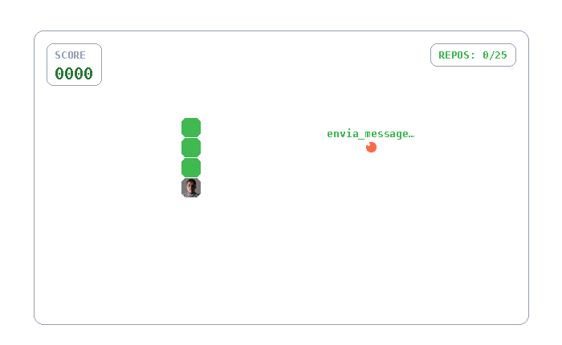
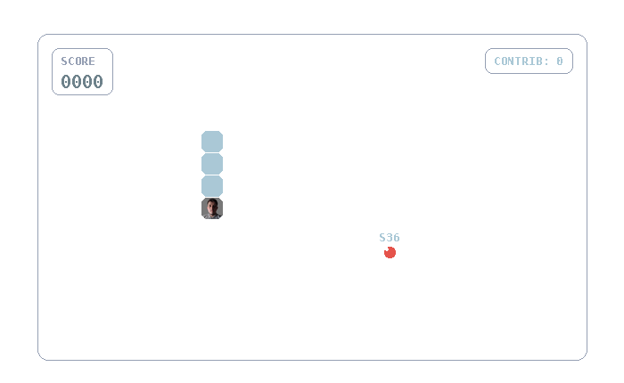
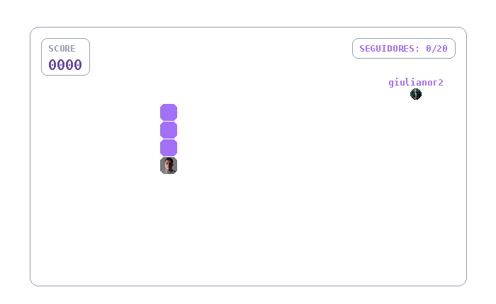

# git-maker

[](https://github.com/lucaskawatoko/git-maker/actions/workflows/test.yml)

Gera o GIF de um **mini-game** com os seus dados do GitHub (repositórios,
contribuições ou seguidores): a cobrinha (Snake) comendo os dados ou o
**Breakout** quebrando blocos. Totalmente personalizável: cor do jogo e da
comida em qualquer hex, com **fundo transparente** (o GIF se adapta ao tema do
seu README) e com o seu **avatar** na cabeça da cobrinha ou na raquete. Tudo
**dentro do GitHub Actions** — sem servidor, sem hosting.

## Galeria

Exemplos gerados pelo workflow [`samples.yml`](.github/workflows/samples.yml)
com `seed: 42` (mesmo caminho a cada geração):

| Repos (verde, snake) | Commits (azul calcinha) | Seguidores (roxo) | Repos (amarelo, breakout) |
| -------------------- | ----------------------- | ----------------- | ------------------------- |
|  |  |  |  |

## Como usar

Adicione o workflow abaixo em `.github/workflows/contribution-gif.yml` do seu
perfil/repositório e ajuste o `username`:

```yaml
name: contribution-gif

on:
  push:
    branches: [main]
  schedule:
    - cron: "0 0 * * *" # gera novamente todo dia

permissions:
  contents: write

jobs:
  gif:
    runs-on: ubuntu-latest
    steps:
      - uses: actions/checkout@v4

      - name: Generate snake GIF
        uses: lucaskawatoko/git-maker/.github/actions/generate-gifs@main
        with:
          username: "lucaskawatoko"  # seu usuário
          data: "repos"              # repos, commits ou followers
          game: "snake"              # snake ou breakout
          color: "#aac8d6"           # cor do jogo (hex)
          food: "#e5534b"            # cor da comida (hex)

      - name: Commit
        run: |
          git config user.name "github-actions[bot]"
          git config user.email "github-actions[bot]@users.noreply.github.com"
          git add imgs/contribution-animation.gif
          git diff --cached --quiet || git commit -m "chore: atualiza gif de contribuição"
          git push
```

Depois é só referenciar no seu README:

```markdown

```

> Para `data: commits` (contribuições) a action usa a API GraphQL, que exige
> um token. Sem token, as contribuições caem para dados fictícios. Defina o
> secret `GH_TOKEN` no repositório para usar dados reais.

## Inputs

| Input      | Padrão                 | Descrição                                            |
| ---------- | ---------------------- | ---------------------------------------------------- |
| `username` | `lucaskawatoko`        | Usuário do GitHub com os dados                       |
| `data`     | `repos`                | Comida do jogo: `repos`, `commits` ou `followers`    |
| `game`     | `snake`                | Estilo do jogo: `snake` ou `breakout`                |
| `color`    | `#3fb950`              | Cor do jogo em hex (`#rrggbb`)                       |
| `food`     | `#ff6b4a`              | Cor da comida em hex                                 |
| `seed`     | —                      | Semente da simulação; vazio = caminho aleatório      |
| `smooth`   | `true`                 | Movimento interpolado (mais fluido); `false` deixa o GIF menor |
| `output`   | `imgs/contribution-animation.gif` | Caminho do GIF gerado                    |

> O fundo é **transparente** — o GIF usa o fundo do seu README (claro ou
> escuro). A única moldura é a borda da arena.

## Avatar e seguidores

- A **cabeça** da cobrinha é sempre o seu avatar (baixado de
  `https://github.com/{username}.png`). Se o download falhar, cai para a cor
  derivada da `color`.
- Com `data: followers`, cada comida é o **avatar de um seguidor** — a cobrinha
  "come" os seus seguidores, e cada um vale 1 ponto. Sem avatar, cai para o
  círculo da cor `food`.

## Caminho aleatório a cada geração

Sem o input `seed`, o caminho da cobrinha é **aleatório a cada execução** —
seu GIF muda todo dia (o cache-busting automático do `?v=` cuida do resto).
Use `seed: 7` (ou qualquer número) no workflow para fixar um caminho
específico e reproduzível. A abertura não tem título e o fim não faz fade
para transparente, então não há "piscada" no loop do GIF.

## Detalhes da animação

- **Movimento interpolado**: com `smooth: true` (padrão) cada passo é
  suavizado com sub-frames — a cobrinha desliza entre as células em vez de
  teleportar. GIFs ficam maiores; use `smooth: false` para arquivo menor.
- **Crescimento correto**: o planejador de caminho (BFS) sabe quando a
  cobrinha vai crescer e evita atravessar a própria cauda parada.
- **Comida por nível**: a comida escala de tamanho conforme o ranking do item
  (1–4) em `repos`/`commits`. No fim aparece `CONCLUÍDO!` (comeu tudo) ou
  `TEMPO LIMITE` (estourou o número de frames).
- **Feedback ao comer**: cada comida solta um anel de expansão e um popup
  `+N` com o valor ganho.
- **Top 25**: só os 25 primeiros itens viram comida (GIF leve); o HUD mostra
  `TOP 25: X/25` quando há mais dados e a CLI avisa na geração.
- **Barra de progresso**: o HUD traz uma barra preenchida com o avanço da
  cobrinha (`comidas / total`), na cor principal da paleta.
- **Breakout**: com `game: breakout` a bolinha quebra os blocos (um por dado);
  a raquete é o seu avatar (auto-play) e a bolinha tem "pontaria" reflexiva na
  próxima peça — jogo determinístico que sempre termina `CONCLUÍDO!`.

## Cores personalizadas

Qualquer cor em hex funciona. A cabeça é derivada automaticamente da `color`
escolhida para manter contraste — uma cor clara como `#aac8d6` (azul
calcinha) ganha cabeça mais escura, uma cor escura ganha cabeça mais clara.

Sugestões de hex:

| Cor            | Hex        |
| -------------- | ---------- |
| Verde GitHub   | `#3fb950`  |
| Azul calcinha  | `#aac8d6`  |
| Vermelho       | `#e5534b`  |
| Roxo           | `#a371f7`  |
| Amarelo        | `#e3b341`  |
| Rosa           | `#f778ba`  |

## Desenvolvimento local

```bash
pip install -r requirements.txt

# dados fictícios (pré-visualizar)
python -m generator --mock --preview

# dados reais (repos)
python -m generator --user lucaskawatoko

# cobrinha azul calcinha comendo contribuições
python -m generator --user lucaskawatoko --data commits \
  --color "#aac8d6" --food "#e5534b"

# cobrinha roxa comendo seguidores (com avatar na cabeça)
python -m generator --user lucaskawatoko --data followers \
  --color "#a371f7" --food "#3fb950"

# breakout quebrando seus repos
python -m generator --game breakout --mock
```

## Licença

MIT — veja o arquivo [LICENSE](LICENSE).
