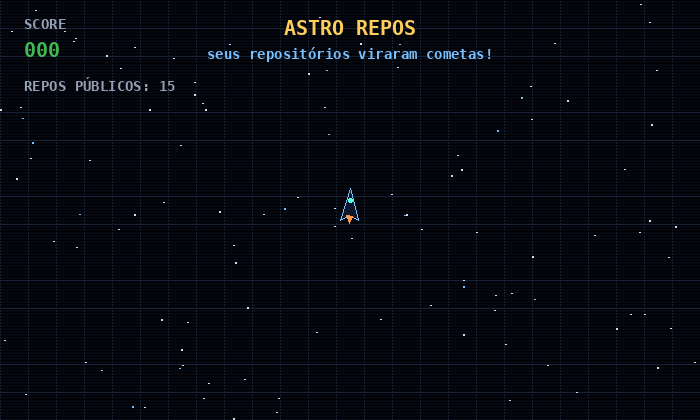
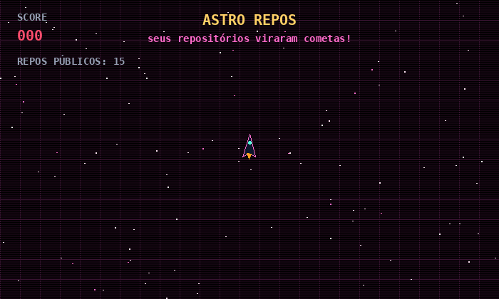
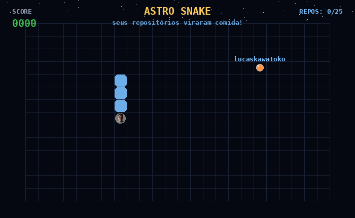
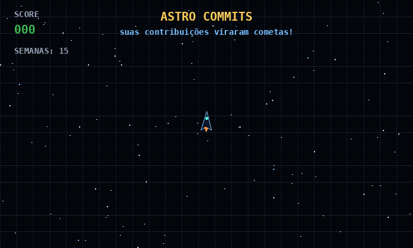
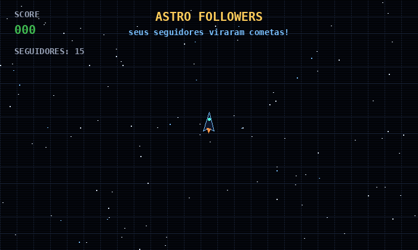
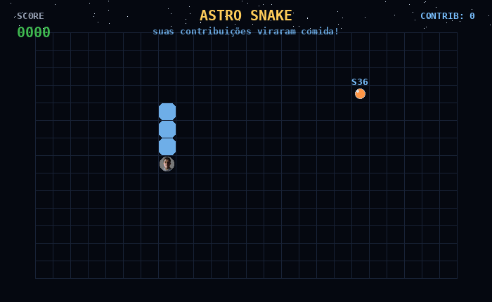
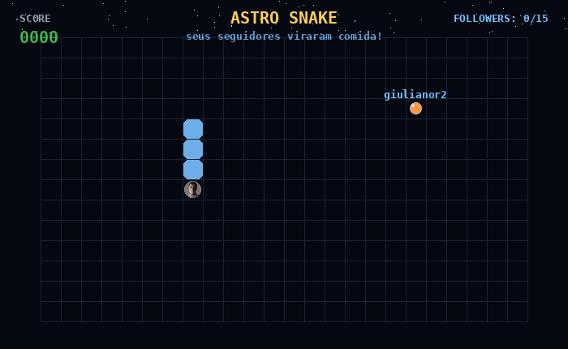
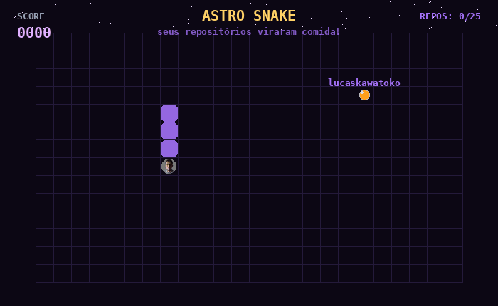

# github-gif-maker

Gera animações GIF de perfil do GitHub **dentro do próprio GitHub** — sem
servidor, sem hosting, sem clone de nada. Você só cola um workflow de poucas
linhas e o GitHub Actions gera o GIF e o commita no seu repositório.

Estilos atuais: **Asteroids** (a nave destrói seus dados como cometas) e
**Snake** (a cobra come seus dados). Os dados podem ser repositórios públicos,
contribuições do ano ou seguidores.

## Galeria

| | | |
| --- | --- | --- |
|  |  |  |
| Asteroids · repos · cyan | Asteroids · repos · pink | Snake · repos · cyan |
|  |  |  |
| Asteroids · commits · cyan | Asteroids · followers · cyan | Snake · commits · cyan |
|  |  | |
| Snake · followers · cyan | Snake · repos · purple | |

> A galeria é gerada automaticamente pelo workflow `samples.yml`.

## Como usar

Adicione o workflow abaixo em `.github/workflows/contribution-gif.yml` do seu
perfil/repositório e ajuste o `username`:

```yaml
name: contribution-gif

on:
  push:
    branches: [main]
  schedule:
    - cron: "0 0 * * *" # gera novamente todo dia

permissions:
  contents: write

jobs:
  gif:
    runs-on: ubuntu-latest
    steps:
      - uses: actions/checkout@v4

      - name: Generate GIF
        uses: lucaskawatoko/git-maker/.github/actions/generate-gifs@main
        with:
          username: "lucaskawatoko"          # seu usuário
          style: "asteroids"                 # asteroids | snake
          data: "repos"                      # repos | commits | followers
          color: "cyan"                      # cyan | pink | green | orange | purple | blue | #rrggbb
          avatar: "true"                     # avatar na animação

      - name: Commit
        run: |
          git config user.name "github-actions[bot]"
          git config user.email "github-actions[bot]@users.noreply.github.com"
          git add imgs/contribution-animation.gif
          git diff --cached --quiet || git commit -m "chore: atualiza gif de contribuição"
          git push
```

Depois é só referenciar no seu README:

```markdown

```

> `data: commits` lê o calendário de contribuições do usuário. `repos` e
> `followers` usam a API pública, sem token. Tudo funciona com o token padrão
> do GitHub Actions. No jogo os cometas aparecem **um por vez** (sequencial):
> o próximo só nasce depois que o atual é destruído. Por padrão todos os itens
> da fonte escolhida entram; use `limit` para limitar o total.

## Inputs

| Input      | Padrão                     | Descrição                                              |
| ---------- | -------------------------- | ------------------------------------------------------ |
| `username` | `lucaskawatoko`            | Usuário do GitHub com os dados                          |
| `style`    | `asteroids`                | `asteroids` ou `snake`                                  |
| `data`     | `repos`                    | `repos`, `commits` ou `followers`                       |
| `limit`    | `0`                        | Máximo de cometas (0 = todos, um por vez)               |
| `color`    | `cyan`                     | Preset (`cyan|pink|green|orange|purple|blue`) ou hex    |
| `avatar`   | `false`                    | `true`/`false` — avatar na animação                     |
| `output`   | `imgs/contribution-animation.gif` | Caminho do GIF gerado                            |

## Paletas

Presets: `cyan`, `pink`, `green`, `orange`, `purple`, `blue`. Ou use qualquer
cor no formato hex (ex.: `color: "#ff7ab8"`); a paleta é derivada dela.

## Desenvolvimento local

```bash
pip install -r requirements.txt

# dados fictícios (para pré-visualizar)
python -m generator --user lucaskawatoko --style asteroids --data repos --mock --preview

# dados reais (repos/followers usam a API pública)
python -m generator --user lucaskawatoko --style snake --data repos --color purple --avatar

# contribuições exigem um token
GH_TOKEN=seu_token python -m generator --user lucaskawatoko --data commits

# controle a quantidade de cometas/comida (0 = todos, um por vez)
python -m generator --user lucaskawatoko --style asteroids --data commits --limit 12
```

O gerador é um pacote Python simples em `generator/`, sem dependências além do
Pillow. Veja `CONTRIBUTING.md` para adicionar novos estilos ou fontes de dados.

## Licença

MIT — veja o arquivo [LICENSE](LICENSE).
